# Расширение диска на виртуальной машине


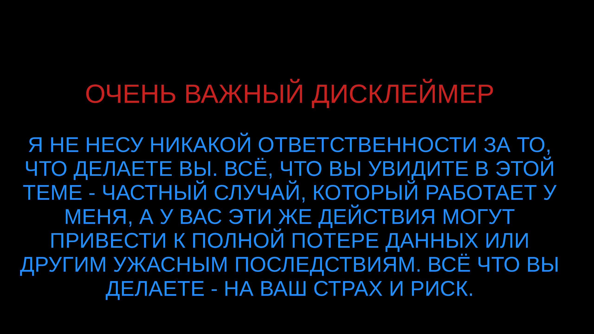

## Задача

Для начала определимся с задачей: есть виртуалка с линуксом и на ней нужно добавить место на файловой системе.  

## Разведка

Нужно определить вводные параметры, так как от них зависит всё. Вывод каждой команды обязательно скриншотьте, так как это поможет понять, как было раньше и, возможно, потом это поможет при восстановлении, если что-то пойдёт не так. Каждая инфраструктура в некотором роде уникальна и я не могу разобрать все варианты. Мы возьмём пару популярных случаев, вы поймёте логику и с остальными случаями справитесь сами. И так, начнём с результата и будем двигаться обратно:

### Какую файловую систему нужно увеличить?

Ответ на этот вопрос должны знать вы. Зачастую это корневая файловая система, которая забивается данными, какими-нибудь логами и, если вам повезёт, вы успеете заранее добавить пространство. Ну или другой вариант, вам заранее говорят или вы сами предвидите, что в какой-то файловой системе, где лежат данные, в будущем добавится много данных и текущего выделенного пространства перестанет хватать.

Чтобы понять, какую файловую систему мы хотим увеличить, нужно посмотреть список примонтированных файловых систем:

```
df -h
```


Так мы можем найти различные параметры, по которым можно будет найти целевую файловую систему. К примеру, если я хочу увеличить корневую файловую систему, то легче будет понять по точке монтирования - корень, т.е. знак слэш. Если, скажем, я не знаю, куда монтируется, но знаю что осталось мало места - то можно будет разобраться по таким параметрам как Use, Available и Size, на сколько процентов используется, сколько места свободно и общий размер файловой системы соответственно. Я определил строку по тем или иным параметрам - и в первом столбце этой строки я увижу файловую систему - ответ на мой вопрос:

```
/dev/mapper/almalinux_alma-root
```

Но если вдруг вы так и не нашли, какую файловую систему нужно увеличить, можно понять по директории. К примеру, вы знаете, что на этом сервере база и она хранит все данные в директории /var/lib, и что для этой базы нужно больше места. Найдём файловую систему по этой директории:

```
df -h /var/lib
```

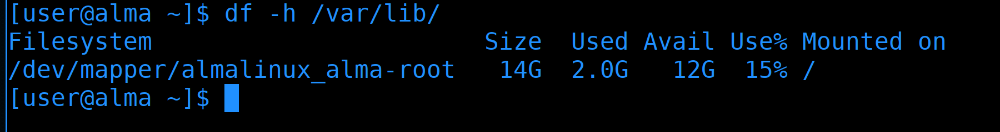

Тут мы видим, что /var/lib относится к корневой файловой системе.

И это только вершина айсберга. Следующий вопрос:

### Где находится файловая система?

Понятно что на диске, но в современных операционных системах могут быть различные прослойки, с которыми тоже нужно считаться. 

К примеру, LVM:


У нас есть диск, на диске есть раздел, на разделе есть физический том, поверх физического тома построена группа томов, на которых строится логический том, поверх которого ставится файловая система. И это ещё очень простой вариант. Если добавить сюда шифрование, рейды и прочее будет целый небоскрёб. Файловая система это всегда последний этаж. И если вы вдруг вздумаете расширить пентхаус, то нужно будет предварительно расширить каждый из нижестоящих этажей, начиная с фундамента.

Возвращаясь к нашему вопросу, давайте не будем гадать и введёт команду:

```
lsblk
```

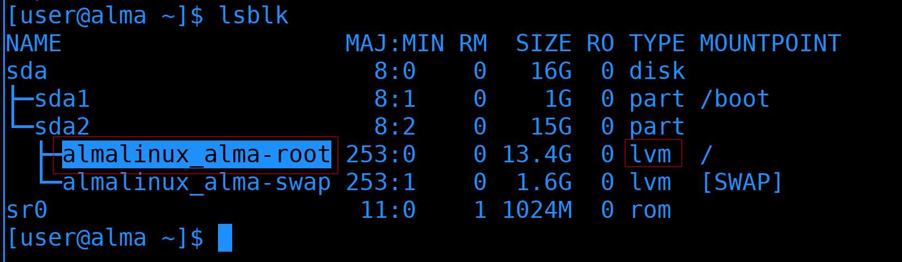

Она поможет и определить небоскрёб, какой этаж на каком стоит, и найти, на чём находится наша файловая система. У нас всё просто - та файловая система, которую мы нашли, находится на LVM. Видно, что LVM ссылается на sda2, который является разделом диска sda. 


И если вдруг вам показалось, что это просто и в этом любой дурак разберётся, то вспомните тему про stratis. Тот же самый lsblk, но нифига не понятно. 

Вспомните математику - главное не ответ, а правильное решение. Поэтому мы пойдём по длинному пути. И так, мы определили, что целевая файловая система находится на LVM. В вашей задаче вместо LVM могут быть другие прослойки. У каждой прослойки свои инструменты для запроса информации, в случае с lvm это lvs, vgs и pvs.

Вспоминаем наш небоскрёб с LVM:


Мы начали с последнего этажа - файловой системы. Зачастую файловая система и нижележащий слой адресуются одинаково, т.е. наш путь /dev/mapper/almalinux_alma-root это и файловая система, и логический том, на котором она находится. Представьте это как бутылку с водой - нижележащий слой это просто оболочка, внутри которого находятся данные.

Спускаясь ниже, мы должны найти, на какой группе томов находится наш логический том, и из каких физических томов состоит эта группа. 

Для первого шага нужна команда lvs с логическим томом:

```
sudo lvs /dev/mapper/almalinux_alma-root
```

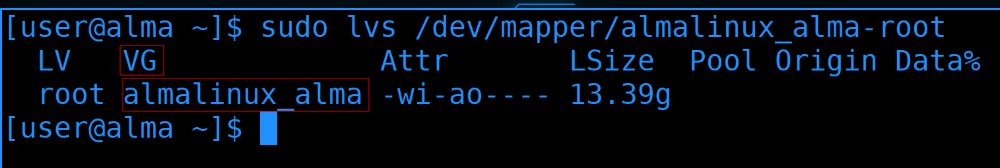

Тут мы определили, что наш логический том относится к группе almalinux_alma.

Для следующего шага нужна команда vgs с этой группой:

```
sudo vgs almalinux_alma
```

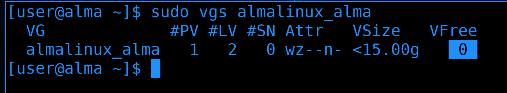

Тут мы можем найти информацию, сколько места всего в этой группе и сколько свободно. Если у вас есть достаточно свободного места в группе, то спускаться ниже нет необходимости, так как пространство можно сразу взять отсюда. Однако, скорее всего, свободного места в группе у вас не будет, поэтому спускаемся ниже.

Берём команду pvs:

```
sudo pvs
```

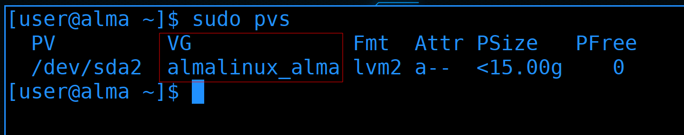

И смотрим, к каким физическим томам относится наша группа. В моём случае это всего один физический том - /dev/sda2, у вас их может быть несколько, даже на разных дисках. В случае с LVM можно увеличить любой, либо добавить ещё один физический том. Но лично я не сторонник создания ещё одних физических томов, дисков и разделов, так как это только усложняет фундамент. Сегодня вы добавите один диск, завтра ещё один и в итоге будет какая-то каша. Лучше увеличить один из физических томов. 

Как и в случае с файловой системой и нижележащим логическим томом, также и физический том относится к нижележащему - они делят один адрес, как бутылка с водой. В нашем случае /dev/sda2 это как второй раздел диска sda, так и логический том. Так мы понимаем, что файловая система в нашем случае относится к диску sda, и его мы должны увеличить.

И так, мы добрались до самого фундамента. Но и здесь нужно нужно разведать информацию, так как популярны два вида фундамента - две таблицы разделов - и тут есть свои нюансы. 

Для начала выведем информацию о диске с помощью fdisk:

```
sudo fdisk -l /dev/sda
```

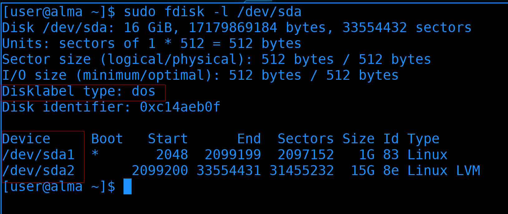

Во-первых, очень желательно, чтобы раздел, который мы хотим увеличить, был крайним. Таблицы разделов очень банально устроены - они хранят информацию где раздел начинается и где заканчивается. К примеру, в моём случае увеличить sda2 будет легко - просто поменять значение End на большее. А вот с sda1 такое не прокатит - сразу после его последнего сектора идёт первый сектор sda2. И сделать, чтобы он закончился в одном месте, а потом продолжился в другом - не получится. И если вдруг была бы задача увеличить sda1, то это было бы довольно сложно, пришлось бы двигать всё содержимое. А если это был бы LVM, то как решение можно было бы создать ещё один раздел и добавить в группу, чего мы не хотели бы делать, но это всяко лучше перемещения раздела. В нашем случае всё просто, но, возможно, в будущем я разберу более проблемные случаи.

Помимо положения раздела также может сыграть роль тип таблицы разделов. Есть два популярных типа - DOS, который часто называют MBR, и GPT. С GPT проблем особо не будет, не считая крайность раздела, а вот с DOS есть ещё один нюанс - деление на основной, расширенный и логический разделы.

Очень многие не знают особенностей таблицы разделов DOS и из-за этого могут по ошибке создать большие проблемы. Поэтому давайте разберёмся.

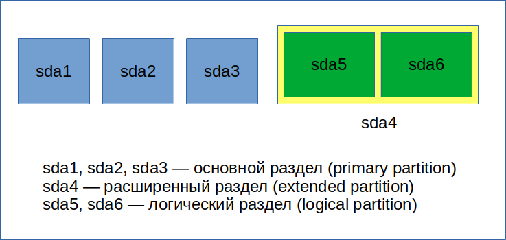

В таблице разделов DOS может быть всего 4 раздела - их называют основными - primary. Но это ограничение стало создавать проблемы, из-за чего придумали обходной механизм - один из этих разделов использовать как эдакую коробку, внутри которой можно создавать другие разделы. Вот этот раздел-коробка называют расширенным разделом, а разделы внутри него называют логическими разделами. Сам по себе расширенный раздел нельзя использовать как обычный, он почти никакого пространства не занимает и является просто ссылкой на логические. Расширенный раздел не обязательно четвёртый, им может быть и второй, и третий раздел, номер не важен. Но говоря с точки зрения увеличения пространства, если целевая файловая система находится внутри логическая раздела - к примеру sda6, то вам сначала надо будет увеличить коробку, а уже потом sda6. Т.е. сначала нужно расширить sda4, а уже потом sda6. 


Возвращаясь к нашему случаю, у нас хоть и таблица разделов DOS, но всего 2 раздела, оба из них основные, поэтому никаких дополнительных нюансов. Просто увеличиваем sda, а потом sda2.

Но sda - это имя диска в самой системе и оно выдаётся динамически при каждом включении. Если у вас подключен один диск - ничего искать и не надо. А если дисков много? Легче всего будет понять по размеру диска. Если же у вас подключено много дисков с одинаковым размером - тут конечно придётся повозиться и нужна информация как с системы, так и с гипервизора.

С точки зрения гостевой системы информацию о диске можно найти с помощью утилиты lsscsi:

```
lsscsi -i
```

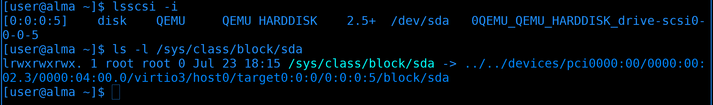


Но на каких-то дистрибутивах её может и не стоять по умолчанию, тогда можно посмотреть через sysfs:

```
ls -l /sys/class/block/sda
```

Опять же, тут всё индивидуально и зависит от гипервизора. На примере с QEMU/KVM можно определить по unit номеру:


Я специально его поменял, чтобы был не 0 - выставил 5-кой. И в системе эта 5-ка видна в наших командах.

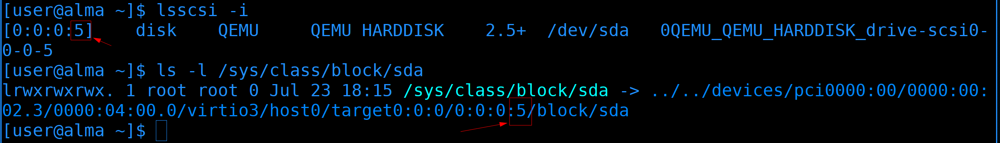

Для остальных гипервизоров нужно гуглить другие методы. Но это всё слишком специфичный случай, поэтому это мы опустим.

Окей, диск, который нам нужно увеличить, мы тоже определили. Следующий вопрос:

### Кто управляет диском?

А точнее - на каком гипервизоре находится виртуальная машина и где находится нужный диск? От этого зависит как мы будем увеличивать его.

- Понятное дело, у каждого гипервизора свой интерфейс и свои команды
- Некоторые гипервизоры для изменения размера диска требуют выключения виртуалки, к примеру - VirtualBox. Другие, к примеру - ESXi - позволяют это делать на лету
- В некоторых случаях диск для виртуалки может быть выдан по сетевому протоколу, к примеру - iSCSI или Fibre Channel (оптоволокно). Т.е. есть отдельная система хранения данных, на ней создали диск и его указали в гипервизоре для конкретной виртуалки. Зачастую, гипервизору выделяют большой виртуальный диск и он там сам управляет пространством для различных виртуалок, но также возможно выделить диск напрямую виртуалке. И вот в таком случае гипервизор не может изменить размер диска, это уже нужно делать в системе хранения данных. Но это довольно специфичный случай. 

Попробуем ответить на этот вопрос. Я буду использовать QEMU/KVM, так как в виртуалбоксе для изменения диска виртуалку надо выключать. К примеру, если в другом гипервизоре без выключения изменить размер диска или добавить новый диск, то гостевая система может не заметить эти изменения и нужно будет вводить дополнительные команды. Если систему выключить и включить, то эти нюансы отпадут. Нам же предпочтительнее без выключения, чтобы рассмотреть побольше.

В прошлом вопросе мы уже взяли информацию о диске с гипервизора, тут же можем посмотреть, где находится файл этого диска.

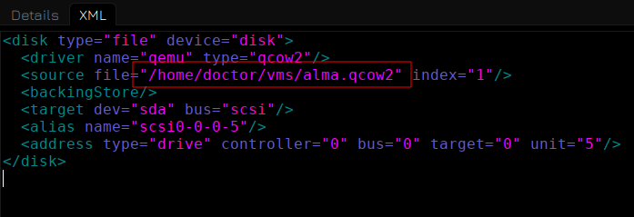

Именно его нам нужно будет увеличить.

И так, всю необходимую информацию мы собрали. Теперь приступим к следующей стадии.

## Разработка

Когда вы планируете какую-то комплексную задачу, чтобы во всём этом не запутаться, можно нарисовать блок-схему. Давайте зафиксируем всю собранную информацию на схеме.

Так как мы задавались вопросами от обратного, т.е. от результата, то теперь переворачиваем порядок вопросов. 

Начнём с вопроса:

- Кто управляет диском?

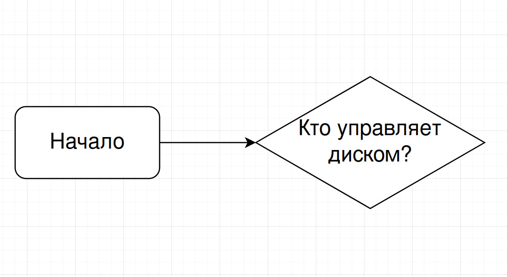

Ответов может быть много и они могут даже не касаться виртуализации. Но рассматривать все варианты в рамках одной темы нереально, поэтому мы предположим два варианта, касающиеся именно виртуализации: гипервизор и система хранения данных.

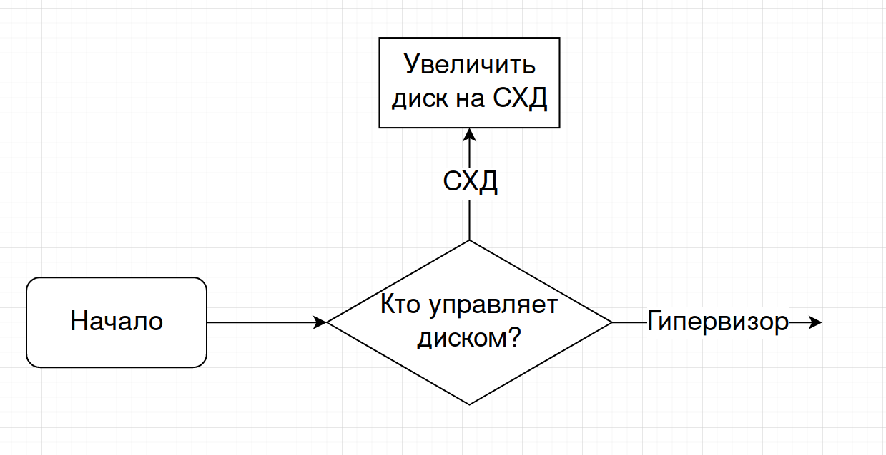

Ещё раз повторюсь, чтобы не было путаницы - когда я говорю "диск находится на СХД", речь не про общий диск, выделяемый хосту с гипервизором, а отдельный диск, выделяемый конкретной виртуалке. Это очень специфичный случай, но он подойдёт для общего понимания картины. 

И так, если диском виртуалки управляет СХД, то увеличиваем его там. Если же диском управляет гипервизор - то нужно задаться ещё одним вопросом: 

- Какой гипервизор?

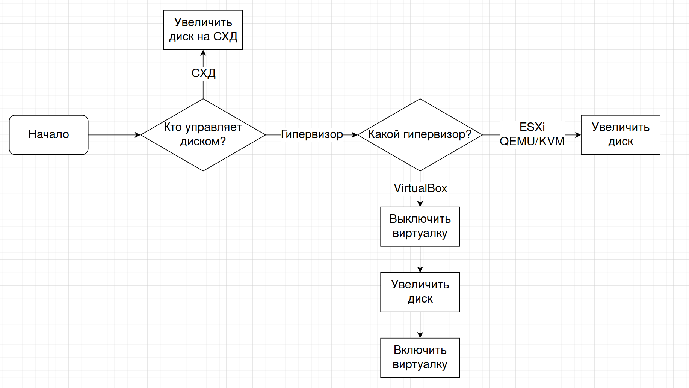

Как мы говорили, некоторые гипервизоры, к примеру - VirtualBox - не позволяют увеличить диск у работающей виртуалки. И в таком случае нужно будет выключить виртуалку, увеличить диск и заново включить виртуалку. Это не проблема для какой-нибудь тестовой или домашней системы. А в рабочей среде не каждую систему можно безболезненно выключить, некоторые системы могут работать годами без перезагрузки. И в таком случае нужна возможность изменять диск на лету. Для примера, это можно сделать на гипервизорах ESXi или QEMU/KVM - просто на работающей виртуалке увеличиваем диск. 

Но при изменении диска на лету нужно задаться ещё одним вопросом:

- Увидела ли система эти изменения?

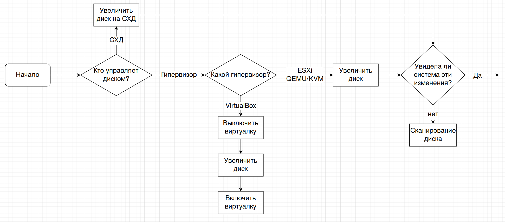

В зависимости от гипервизора и наличия гостевых дополнений, операционная система может увидеть это изменение, а может и не увидеть. Если нет - то нужно дополнительно вручную запустить сканирование диска в гостевой системе.

И после того как система увидит, что диск увеличился, возникает следующий вопрос:

- Где находится файловая система?

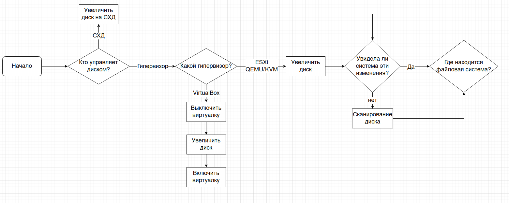

Ответом на этот вопрос будет башня, которую мы изучили. 

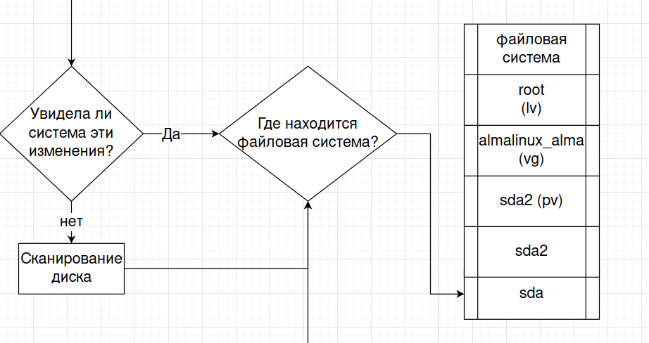

Как мы и говорили, в каждой системе эта башня может отличаться, у кого-то больше этажей, у кого-то меньше. Но суть одна и та же - нужно поочерёдно увеличить каждый этаж, начиная с фундамента. Все предыдущие шаги были для увеличения диска sda. Увеличение каких-то этажей будет совмещено - скажем, при увеличении физического тома(pv) группа томов тоже увеличивается(vg).

Ну и после того как мы увеличили файловую систему, стоит убедиться, что всё сработало - проверим размер файловой системы. 

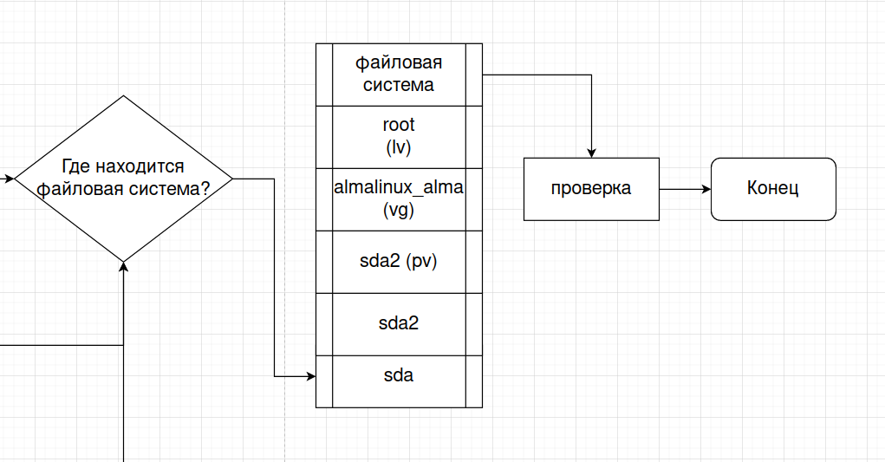

Теперь зададимся вопросом:

- А какие тут риски?

Ситуаций может быть много, но есть две особые, которые всё перекрывают - можно:

- сломать диск
- сломать файловую систему

К примеру, вместо увеличения диска можно случайно указать диск меньшего размера. Да, обычно есть какая-то защита от дурака, но представим, что не помогло и мы насильно уменьшили диск. Тут уже ничего не поделать, единственное спасение - это восстанавливать бэкап. Обычно это очень долго и мучительно, а для компании это может быть очень болезненно. А если бэкапа нет - страшно представить. Так что единственный, хоть и болезненный вариант - бэкап. Поэтому прежде всего убедитесь, что есть бэкап целевой системы. Ну и есть куча различных ошибок, которые можно совершить и поломать разметку диска, файловую систему и всё такое. 

Так как риски огромные, то обязательно указываем бэкап в начале нашей схемы. Ну и если случится худший сценарий, сервис будет не работать, пользователи будут доставать вас звонками, пока вы будете возиться с восстановлением бэкапа. Это очень плохо скажется на ваших нервах, поэтому желательно подобные операции проводить в нерабочее время.

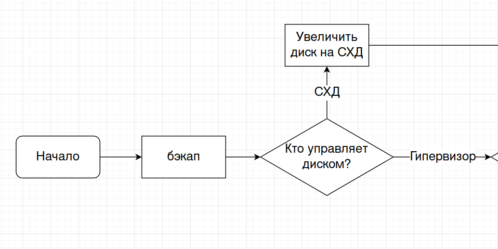

Итоговая блок-схема выглядит так:

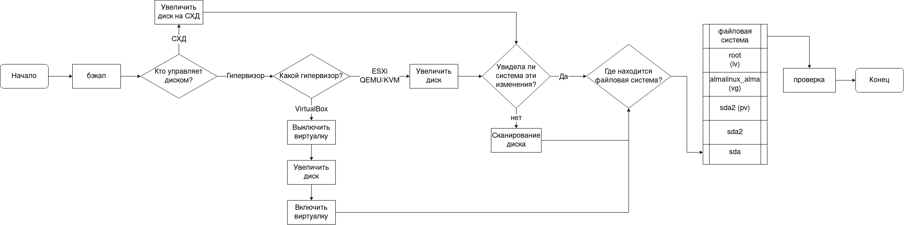

И так, мы разработали план, мы оценили риски, теперь приступаем к реализации.

## Реализация

Начальные шаги будут отличаться на разных системах в зависимости от гипервизора и расположения диска. Будем считать, что вы знаете как на вашем гипервизоре сделать бэкап виртуалки или увеличить диск, я же рассмотрю свой вариант на QEMU/KVM.

### Бэкап

И так, в качестве бэкапа копируем диск, о котором мы узнали при разведке:

```
cp -v /home/doctor/vms/alma.qcow2{,.bkp}
```

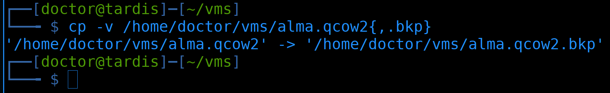

### Диск

Дальше увеличиваем диск до нужного размера:

```
virsh blockresize almalinux8 /home/doctor/vms/alma.qcow2 20GB
```

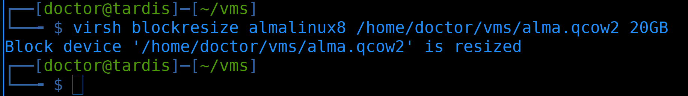

Проверим, увидела ли система изменения? Для этого сойдёт fdisk:

```
sudo fdisk -l /dev/sda
```

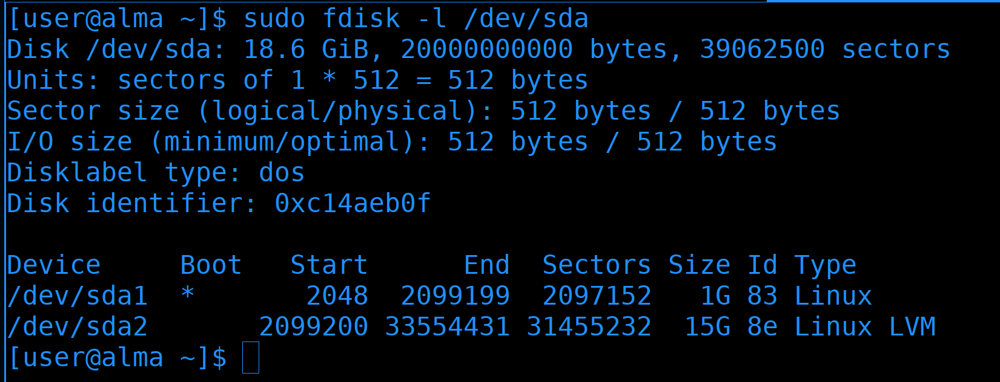

Сейчас мы видим 18 Гибибайт, а раньше было 16. Значит увеличилась. Кто-то может спросить - вроде до 20 увеличивали, почему же 18? Потому что мы выдали 20 гигабайт, а в fdisk-е видим это в гибибайтах.

Если же ваша система не увидела изменения диска, то, как мы и говорили, нужно просканировать диск на изменения. Это можно сделать с помощью следующей команды:

```
sudo su
echo 1 > /sys/block/sda/device/rescan
```

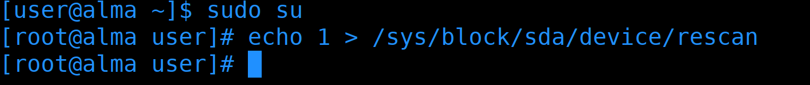

Эта команда заставит ядро пересканировать информацию о диске и заметить, что, оказывается, у диска другой размер.

И так, фундамент у нас увеличен.

- [ ] filesystem
- [ ] root (lv)
- [ ] almalinux_alma (vg)
- [ ] sda2 (pv)
- [ ] sda2
- [x] sda

### Раздел

Теперь нужно увеличить раздел sda2.

И так, заходим в fdisk:

```
sudo fdisk /dev/sda
p
```

и смотрим таблицу разделов.

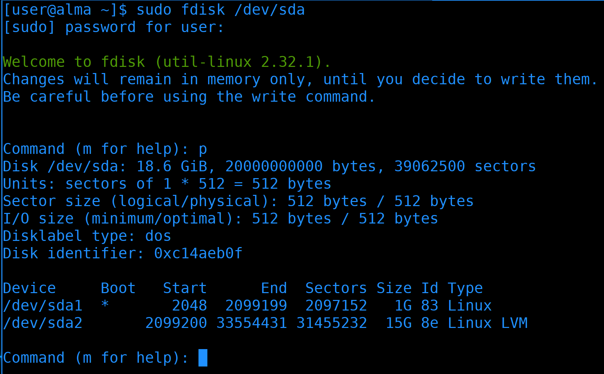

Как вы помните, тут важно, чтобы раздел был последним. В чём суть увеличения раздела - мы удаляем раздел и создаём заново. Не бойтесь, ничего не поломается если удалить раздел и сразу заново создать с тем же начальным сектором и чтобы конечный сектор был тем же, или больше. Начальный и конечный сектора видны в столбике Start и End. Т.е. пока вы находитесь в fdisk, никакие изменения на диск не пишутся, изменения сохраняются только при выходе. 

И ещё раз напомню, что если у вас таблица разделов DOS и есть расширенный раздел, то сначала надо увеличить расширенный раздел, а уже потом логический раздел внутри расширенного.

В нашем случае расширенного раздела нет, поэтому начинаем с удаления второго раздела:

```
d
2
```

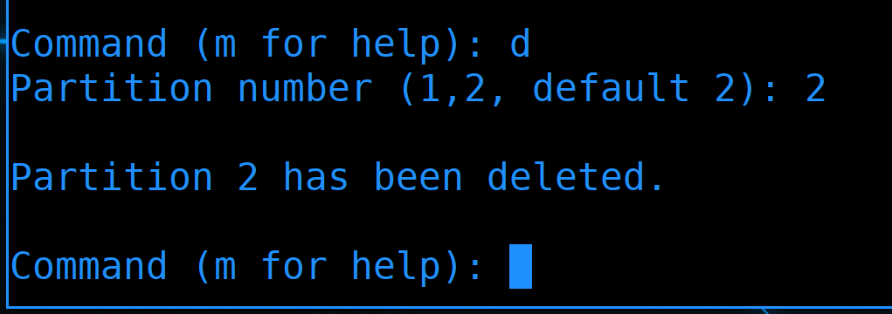

Теперь нужно заново создать второй раздел:

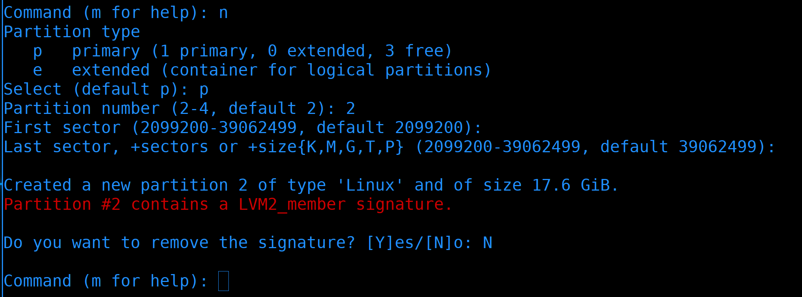

```
n
p
2
Enter
Enter
N
```

Обратите внимание, что при создании первый сектор совпадает с тем, что был до удаления. Конечный сектор раньше был 33 миллиона, а теперь стал 39 миллионов, т.е. диапазон увеличился - а значит и раздел стал больше.

fdisk увидел, что на разделе есть метка LVM, и уточнил, стоит ли нам её стереть. Выбираем N, так как мы не хотим затрагивать никакие данные. 

Прежде чем сохранить изменения нажимаем 

```
p
```

и убеждаемся, что размер второго раздела увеличился. Если вы вдруг сделали что-то не так, размер стал меньше или номер раздела не тот или ещё что-то не так - то нажимаете q, чтобы выйти без сохрания.

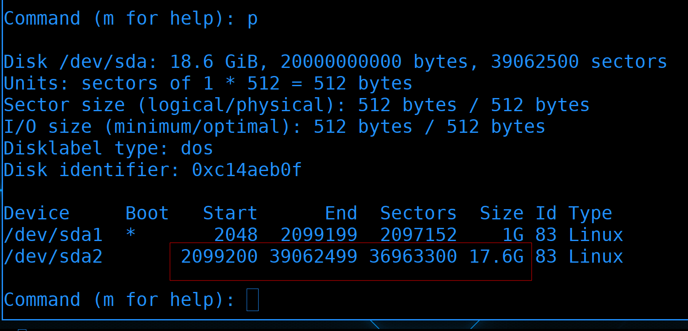

Если же всё правильно, пишите w для сохранения изменений.  

```
w
```

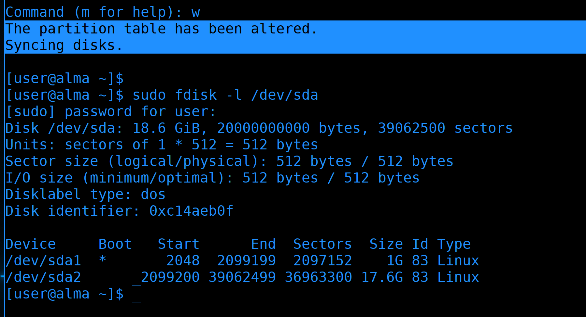

При этом вы увидите сообщение, что таблица разделов была изменена. Если же выходит какая-либо ошибка, допустим, что не получается изменить таблицу разделов и изменения будут применены при перезагрузке, то, возможно, вы где-то ошиблись. Система не смогла изменить разделы, которые используются. Тут стоит проверить по скриншотам, которые вы обязательно должны были сделать при этапе разведки, а как было раньше. И сравнить как стало сейчас, не получилась ли каша в первых и последних секторах каждого раздела.

В нашем случае никаких ошибок не было, раздел увеличился, значит ставим ещё одну галочку.

- [ ] filesystem
- [ ] root (lv)
- [ ] almalinux_alma (vg)
- [ ] sda2 (pv)
- [x] sda2
- [x] sda

### Физический том (pv)

Теперь очередь физического тома. 

Посмотрим размер раздела и физического тома на нём:

```
sudo fdisk -l /dev/sda2
sudo pvs
```

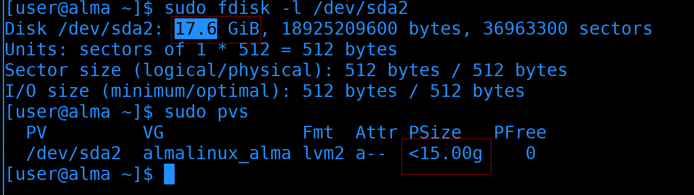

Как видите, LVM пока не заметила изменений. А значит нам нужно увеличить размер физического раздела с помощью команды pvresize:

```
sudo pvresize /dev/sda2
```

И проверить результат:

```
sudo pvs
```

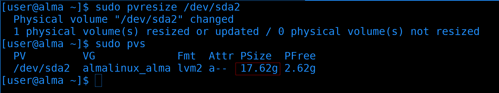

Теперь видно, что размер физического тома увеличился.

- [ ] filesystem
- [ ] root (lv)
- [ ] almalinux_alma (vg)
- [x] sda2 (pv)
- [x] sda2
- [x] sda

### Группа томов (vg)

Если посмотреть группу томов, то видно, что места стала больше, т.е. с группой томов нам никаких дополнительных операций делать не надо.

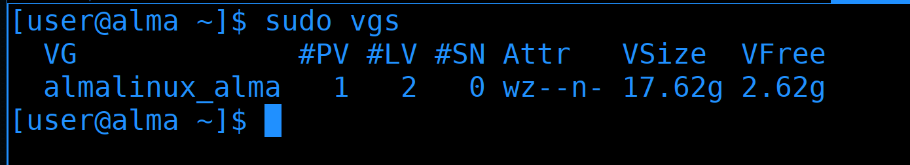

- [ ] filesystem
- [ ] root (lv)
- [x] almalinux_alma (vg)
- [x] sda2 (pv)
- [x] sda2
- [x] sda

### Логический том (lv)

Дальше нас интересует логический том. Для его увеличения используем команду lvextend:

```
sudo lvextend almalinux_alma/root -l +100%FREE -r
```

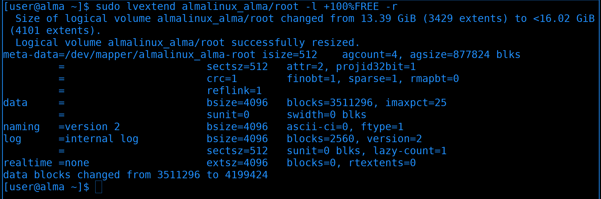

Этой командой я выделил всё свободное место в группе томов этому разделу, и, как видно по выводу, его размер увеличился почти на 3 гигабайта. Тут же я использовал ключ -r для увеличения файловой системы на этом логическом томе.

- [ ] filesystem
- [x] root (lv)
- [x] almalinux_alma (vg)
- [x] sda2 (pv)
- [x] sda2
- [x] sda

### Файловая система

Если же у вас была другая башня, скажем, без LVM, то вам пришлось бы увеличивать файловую систему самостоятельно. В зависимости от типа файловой системы, для ext4 команда была бы одной:

```
sudo resize2fs /dev/mapper/almalinux_alma-root
```

а для xfs другой:

```
sudo xfs_growfs /dev/mapper/almalinux_alma-root
```

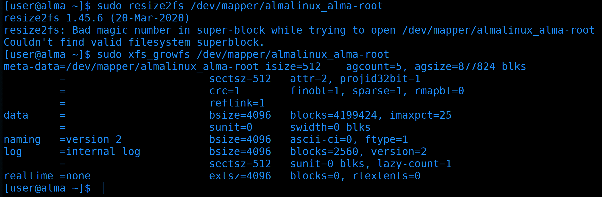

Т.е. у каждого типа файловой системы свои команды.

Теперь убедимся, что файловая система действительно выросла:

```
df -h /
```

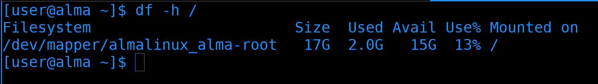

Как видите, теперь размер корневой файловой системы больше.

- [x] filesystem
- [x] root (lv)
- [x] almalinux_alma (vg)
- [x] sda2 (pv)
- [x] sda2
- [x] sda


## Итоги

В целом, вся эта задача не такая сложная. Но есть отягчающий фактор - ошибка может привести к потере данных. И так как нет людей, которые не ошибаются, всегда делайте бэкап заранее и проверяйте, что бэкапы рабочие. 

Если вам показалось, что это долго и сложно, я просто сильно растянул тему, чтобы детальнее объяснить какие-то нюансы. В реальной среде вы наловчитесь и всё это будете делать автоматом за считанные минуты. 


